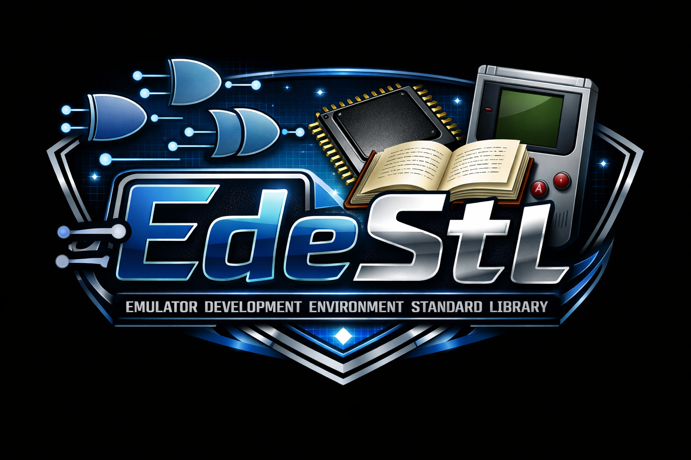

<!-- Improved compatibility of back to top link: See: https://github.com/othneildrew/Best-README-Template/pull/73 -->
<a id="readme-top"></a>
<!--
*** Thanks for checking out the Best-README-Template. If you have a suggestion
*** that would make this better, please fork the repo and create a pull request
*** or simply open an issue with the tag "enhancement".
*** Don't forget to give the project a star!
*** Thanks again! Now go create something AMAZING! :D
-->


<!-- PROJECT SHIELDS -->
<!--
*** I'm using markdown "reference style" links for readability.
*** Reference links are enclosed in brackets [ ] instead of parentheses ( ).
*** See the bottom of this document for the declaration of the reference variables
*** for contributors-url, forks-url, etc. This is an optional, concise syntax you may use.
*** https://www.markdownguide.org/basic-syntax/#reference-style-links
-->
[![Contributors][contributors-shield]][contributors-url]
[![Forks][forks-shield]][forks-url]
[![Stargazers][stars-shield]][stars-url]
[![Issues][issues-shield]][issues-url]
[![project_license][license-shield]][license-url]
[![LinkedIn][linkedin-shield]][linkedin-url]


<!-- PROJECT LOGO -->
<br />
<div align="center">
  <a href="https://github.com/github_username/repo_name">
    
  </a>

<h3 align="center">Emulator Development Environment Standard Library</h3>

  <p align="center">
    This Standard Library is utilized to generate an Ede Instance. It contains all of the Gui Compoments and Methods to create a Ede Instance with the GuiEde class. The EdeStl also contains several other componenets that can be utilized in other projects as well and it is why the EdeStl is separated from the <a href="https://github.com/jabauer1998/EdeGen">Emulator Development Environment Generator Tool</a> repository.
    <br />
    <a href="https://github.com/jabauer1998/EdeStl"><strong>Explore the docs »</strong></a>
    <br />
    <a href="https://github.com/jabauer1998/EdeStl/issues/new?labels=bug&template=bug-report---.md">Report Bug</a>
    &middot;
    <a href="https://github.com/jabauer1998/EdeStl/issues/new?labels=enhancement&template=feature-request---.md">Request Feature</a>
  </p>
</div>

The EdeStl is broken down into several sub components and sub directories.

1) ede/stl/gui -> Everything to build the gui Ede instance
2) ede/stl/interpreter -> Contains a Verilog interpreter that can either report to the Ede Instance(EdeInterpreter) or the console(Verilog Interpreter)
3) ede/stl/compiler -> Contains a Verilog to Java Byte Code compiler
4) ede/stl/common -> Contains a bunch of utility files that are utilized elsewhere in the code
5) ede/stl/ast -> Contains all of the ast nodes of Verilog
6) ede/stl/parser -> Contains the Verilog Parser and Lexer

<!-- TABLE OF CONTENTS -->
<details>
  <summary>Table of Contents</summary>
  <ol>
    <li>
      <a href="#about-the-project">About The Project</a>
      <ul>
        <li><a href="#built-with">Built With</a></li>
      </ul>
    </li>
    <li>
      <a href="#getting-started">Getting Started</a>
      <ul>
        <li><a href="#prerequisites">Prerequisites</a></li>
        <li><a href="#installation">Installation</a></li>
      </ul>
    </li>
    <li><a href="#usage">Usage</a></li>
    <li><a href="#roadmap">Roadmap</a></li>
    <li><a href="#contributing">Contributing</a></li>
    <li><a href="#license">License</a></li>
    <li><a href="#contact">Contact</a></li>
    <li><a href="#acknowledgments">Acknowledgments</a></li>
  </ol>
</details>


<!-- ABOUT THE PROJECT -->
## About The Project

[![Product Name Screen Shot][product-screenshot]](images/EdeStlSample.png)`

<p>The EDE is software that is inspired by the PEP9 virtual computer. PEP9 is an educational tool that allows students to learn the basics of how a computer works without having to dive into any actual hardware. It is a much more cost effective solution for universities to teach undergrad/introductory level assembly/computer systems courses. The clever GUI also allows the students to easily visualize whats going on inside the CPU. It does have its limits. Since PEP 9 is not an actual computer, the assembly syntax is useless in industry. It also offers a very impractical register file. To account for this the EDE is a system where an instructor(or anyone else) can create an emulator with a Hardware Description Language(Verilog). This gui can be utilized to like the pep9 to teach a computer systems course, however with a customized processor. The HDL component of the project can be utilized to teach a computer architecture course without having to buy expensive FPGA's. The EDE can also be used in industry as a high level final step pre-silicon verification tool. Fabless semiconductor companies can use it to verify that there architecture works prior to sending the design off to get manufactered and if it doesn't they can use the gui to give them insight about where the error is occuring.</p>

<p align="right">(<a href="#readme-top">back to top</a>)</p>


### Built With

* [![Java][Java.java]][Java-url]
* [![Powershell][Powershell.ps1]][Powershell-url] or [![Bash][Bash.sh]][Bash-url]

<p align="right">(<a href="#readme-top">back to top</a>)</p>


<!-- GETTING STARTED -->
## Getting Started

1) To get started install git and if you have git clone the repository like so
    ```
    git clone https://github.com/jabauer1998/EdeStl
    ```

2) After that change directory into the parent directory called EdeStl.
3) Once in that directory you can run the command:

    For windows users:
    ```
    ./build/WindowsBuild.ps1 build
    ```

    For mac/linux users:
    ```
    ./build/LinuxBuild.sh build
    ```

5) To run the sample demo run the follwing command:

    For windows users:
    ```
    ./build/WindowsBuild.ps1 run
    ```

    For Linux or Mac users run:
    ```
    ./build/LinuxBuild.sh run
    ```

### Prerequisites

* Git
  
  For Windows: [Git Windows Install](https://git-scm.com/install/windows)

  For Linux: run the follwoing command
  ```
  apt-get install git
  ```
* [Java Download (Must be 25 or higher)](https://www.oracle.com/java/technologies/downloads/#java25)

  Note: you can install any JDK or JVM it just needs to be java 25 or higher
* Powershell (Windows Only):
  ```
  winget install --id Microsoft.PowerShell.Preview --source winget
  ```
  

### Installation
<p>The package information is available on SourceForge. The steps for installing it are below. Read all steps before clicking on the link for best advice</p>

1. Follow this link: [SourceForge.net](https://sourceforge.net/projects/edestl)
2. Wait five seconds to install or click install
3. Note: Install in a directory where it is easily accessable.

<p align="right">(<a href="#readme-top">back to top</a>)</p>


<!-- USAGE EXAMPLES -->
## Usage

Use this space to show useful examples of how a project can be used. Additional screenshots, code examples and demos work well in this space. You may also link to more resources.

_For more examples, please refer to the [Documentation](https://example.com)_

<p align="right">(<a href="#readme-top">back to top</a>)</p>


<!-- ROADMAP -->
## Roadmap

- [ ] More Interpreter and Compiler Support
    - [ ] VHDL Interpreter
    - [ ] VHDL To Java Bytecode Compiler
    - [ ] SystemC Interpreter
    - [ ] SystemC To Java Bytecode Compiler
    - [ ] C/C++ Interpreter
    - [ ] C/C++ To Java Bytecode Compiler
    - [ ] Chisel(Scala) Interpreter (May alraedy Exist)
    - [ ] Chisel(Scala) To Java Bytecode Compiler (May already exist)
- [ ] Gate Graph Viewer
- [ ] Wave Generator / viewer
- [ ] Pipeline viewer
- [ ] FPGA Synthesis and Place and Route

See the [open issues](https://github.com/github_username/repo_name/issues) for a full list of proposed features (and known issues).

<p align="right">(<a href="#readme-top">back to top</a>)</p>


<!-- CONTRIBUTING -->
## Contributing

Contributions are what make the open source community such an amazing place to learn, inspire, and create. Any contributions you make are **greatly appreciated**.

If you have a suggestion that would make this better, please fork the repo and create a pull request. You can also simply open an issue with the tag "enhancement".
Don't forget to give the project a star! Thanks again!

1. Fork the Project
2. Create your Feature Branch (`git checkout -b feature/AmazingFeature`)
3. Commit your Changes (`git commit -m 'Add some AmazingFeature'`)
4. Push to the Branch (`git push origin feature/AmazingFeature`)
5. Open a Pull Request

<p align="right">(<a href="#readme-top">back to top</a>)</p>

### Top contributors:

<a href="https://github.com/jabauer1998/EdeStl/graphs/contributors">
  
</a>


<!-- LICENSE -->
## License

Distributed under the project_license. See `LICENSE.txt` for more information.

<p align="right">(<a href="#readme-top">back to top</a>)</p>


<!-- CONTACT -->
## Contact

Jacob Bauer - jabauer.1998@gmail.com

Project Link: [https://github.com/jabauer1998/EdeStl](https://github.com/jabauer1998/EdeStl)

<p align="right">(<a href="#readme-top">back to top</a>)</p>


<!-- ACKNOWLEDGMENTS -->
## Acknowledgments

* [DePauw CS Department](https://www.depauw.edu/academics/majors-and-minors/about-computer-science/faculty-and-staff)
* [PEP 9/Computer Systems By J Stanley Warford](https://computersystemsbook.com/5th-edition/pep9)
* [Dragon Book](https://en.wikipedia.org/wiki/Compilers:_Principles,_Techniques,_and_Tools)

<p align="right">(<a href="#readme-top">back to top</a>)</p>


<!-- MARKDOWN LINKS & IMAGES -->
<!-- https://www.markdownguide.org/basic-syntax/#reference-style-links -->
[contributors-shield]: https://img.shields.io/github/contributors/jabauer1998/EdeStl.svg?style=for-the-badge
[contributors-url]: https://github.com/jabauer1998/EdeStl/graphs/contributors
[forks-shield]: https://img.shields.io/github/forks/jabauer1998/EdeStl.svg?style=for-the-badge
[forks-url]: https://github.com/jabauer1998/EdeStl/network/members
[stars-shield]: https://img.shields.io/github/stars/jabauer1998/EdeStl.svg?style=for-the-badge
[stars-url]: https://github.com/jabauer1998/EdeStl/stargazers
[issues-shield]: https://img.shields.io/github/issues/jabauer1998/EdeStl.svg?style=for-the-badge
[issues-url]: https://github.com/jabauer1998/EdeStl/issues
[license-shield]: https://img.shields.io/github/license/jabauer1998/EdeStl.svg?style=for-the-badge
[license-url]: https://github.com/jabauer1998/EdeStl/LICENSE.txt
[linkedin-shield]: https://img.shields.io/badge/-LinkedIn-black.svg?style=for-the-badge&logo=linkedin&colorB=555
[linkedin-url]: https://www.linkedin.com/in/jacobbauer13
[product-screenshot]: images/EdeStlSample.png
[Java.java]: https://img.shields.io/badge/java-%23ED8B00.svg?style=for-the-badge&logo=openjdk&logoColor=white
[Java-url]: https://www.oracle.com/java/technologies/downloads/#java26
[Powershell.ps1]: https://img.shields.io/badge/PowerShell-%235391FE.svg?style=for-the-badge&logo=powershell&logoColor=white
[Powershell-url]: https://learn.microsoft.com/en-us/powershell/scripting/install/install-powershell?view=powershell-7.6
[Bash.sh]: https://img.shields.io/badge/bash_script-%23121011.svg?style=for-the-badge&logo=gnu-bash&logoColor=white
[Bash-url]: https://www.gnu.org/software/bash


